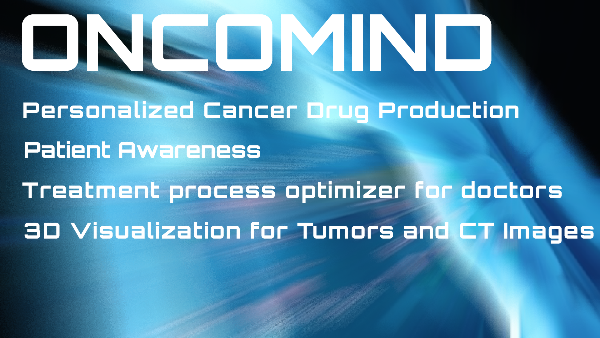
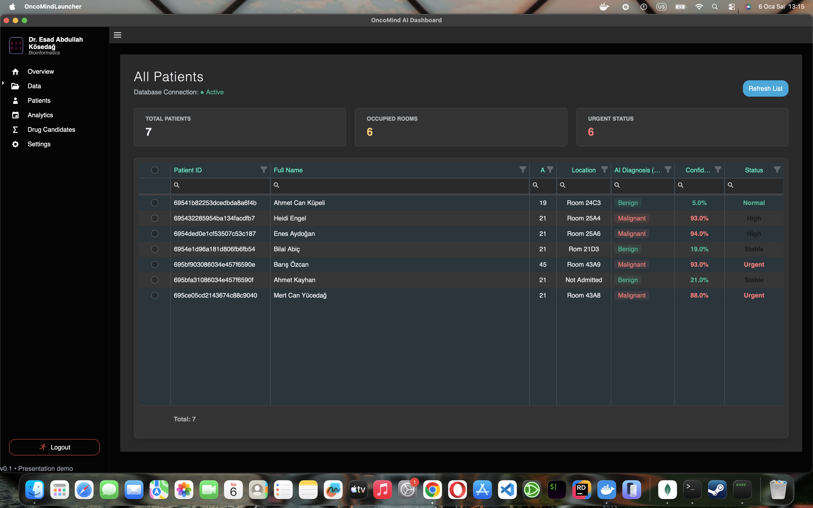
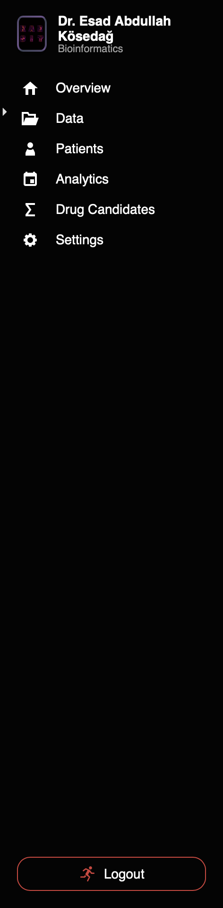
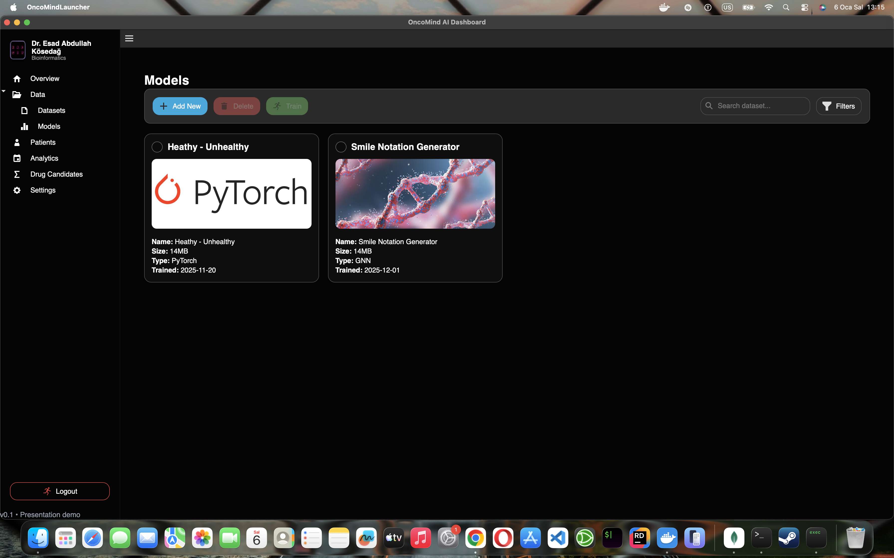
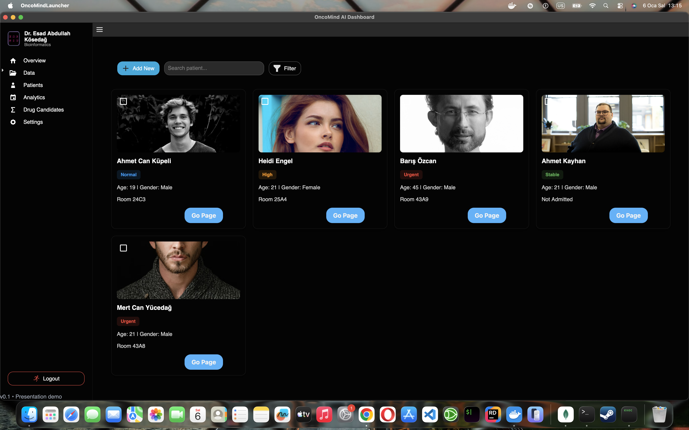
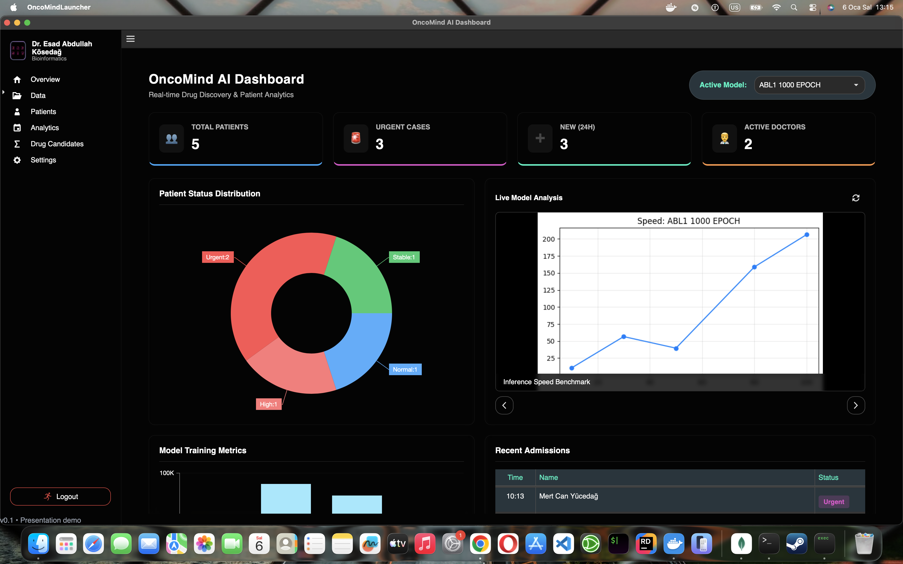
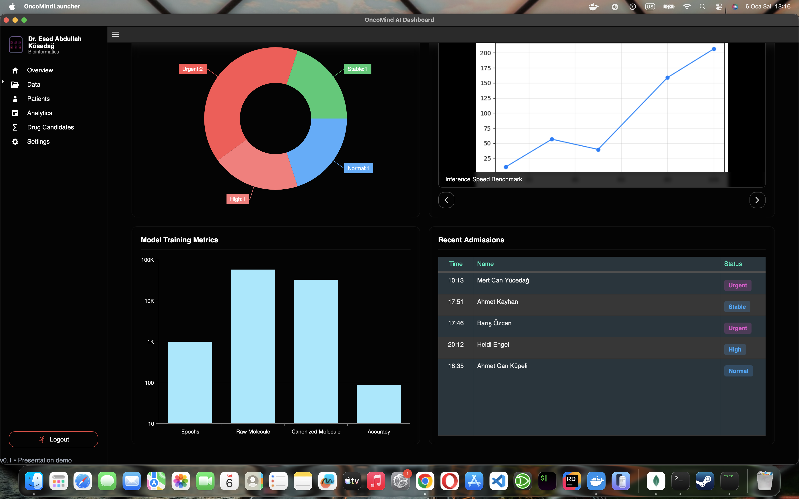

# OncoMind — AI-driven Cancer Analysis Starter


## What it does?
OncoMind is an AI driven cancer analysis platform, it's purpose is complex but meaningfull

In this project, we will use scientific research data on cancer and AI models fine tuned or specifically trained with this research in an integrated way to perform many tasks such as the production of personalized cancer drugs in a highly experimental way, modules that optimize the treatment process on behalf of doctors, and visualizing tumor and CT images in 3D and using them in the treatment process.
And lastly we will provide awareness guides for our precious patients 


---

## Details for developers
<details>

## 🚀 Quickstart (Local, Requires Docker)

Will be in live soon[oncomind.ai]


```bash
# from repo root
docker compose up --build
# open frontend: http://localhost:5173
# API: http://localhost:5000/api/predict?sample=1
# ML service: http://localhost:8000/predict?sample=1
````

---


## ⬇️ Requirements
#### Packages

```bash
fastapi
uvicorn[standard]
numpy
pandas
scikit-learn
pydantic
pytest
opencv-python
tensorflow
kaggle
tissue-detection
PyOpenGL
pyvista
skimage
glfw
pygame
pydantic_settings
pip-audit
bandit
httpx
```

#### How to install packages:
```bash
pip install -r requirements.txt
```


---

## 🧪 Test

### Test Files


#### how to start the app

Run with:

```bash
uvicorn app:app --reload --host 127.0.0.1 --port 8000
```

#### early_diagnosis_test_from_image.py

Run with:

```bash
python early_diagnosis_test_from_image.py --model MODEL_PATH\<model_name>.pt --test-image PATH_OR_URL
```

#### test_or_diagnosis_from_video_source.py

Run with:

```bash
python early_diagnosis_test_from_image.py --model MODEL_PATH\<model_name>.pt --video-source VIDEO_PATH
```

---

## Pages


### Sign In Page


### Sign Up Page


### Home



### Menu


### Model Page


### Patient Page


### Patient Info Page


### Analytics Page




---

## 🔄 Converters

### Torch → ONNX

Run with:

```bash
python torch_to_onnx.py --model MODEL_PATH\<model_name>.pt --output OUTPUT_PATH\<model_name>.onnx
```
### cn3 to PDB format 

#### cn3_to_pdb.py

Run with:
```bash
python cn3_to_pdb.py --input example.cn3 --output example.pdb
```

